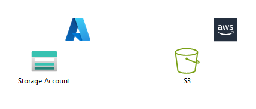
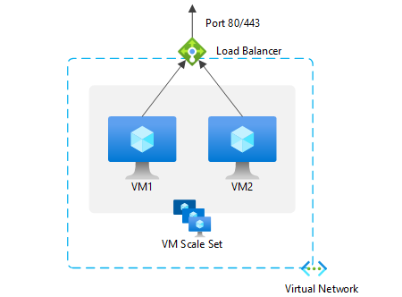
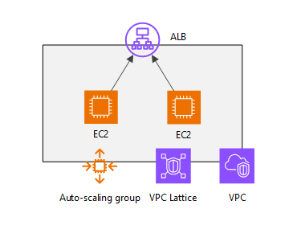
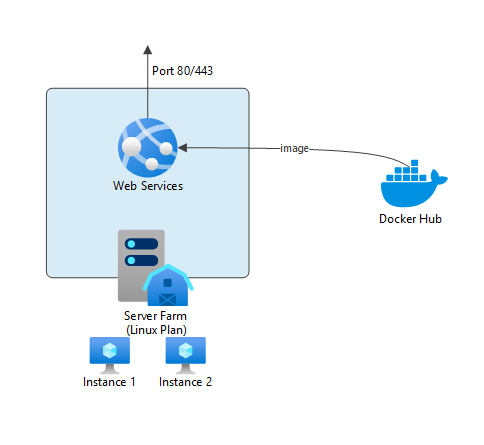

# A Web Tier Demo for an interview
## Files
 - README.md    # *This file*
 - images       # *Contains architectural diagrams of this file*
 - dockerfile   # *Contains the file for build the docker image of an NGINX static web server*
 - iac          # *Contains the ARM Template for provision the infrastructure*

## 0. How to Deploy

**Az CLI**
```
az group create -l australiasoutheast -n '<RESOURCE_GROUP_NAME>'
az deployment group create --resource-group '<RESOURCE_GROUP_NAME>' --name <DEPLOYMENT_NAME> --template-file iac/template.json --parameters iac/parameters.json
```
**Azure PowerShell**
```
New-AzResourceGroup -Name '<RESOURCE_GROUP_NAME>' -Location australiasoutheast

New-AzResourceGroupDeployment -ResourceGroupName <RESOURCE_GROUP_NAME> -Name <DEPLOYMENT_NAME> -TemplateFile iac\template.json -TemplateParameterFile iac\parameters.json -subscriptionId <SUBSCRIPTION_ID> -serverFarmResourceGroup <RESOURCE_GROUP_NAME>
```
## 1. Objective
To achieve highest possible "score" for the criteria.

## 2. Requirements Analyse
 Must haves
 - Static web page
 - Self-healing
 - VM based NGINX host, multiple instances
 - Either Azure or AWS
 - IaC solution -> Terraform, Bicep/ARM, CloudFormation

 Bonus
 - Dockerfile provide
 - Push image to a public registry
 - Use user-data / cloud-init and run image

 ## 3. Solution Choosing
 
 ### **Potential Solutions**
 ### 1. Azure Storage Blob / AWS S3
 

 1. Create an Azure Storage Blob or AWS S3
 2. Put the static webpage file in the container / bucket

 ### 2. Azure VMSS with Load Balancer
 
 
1. Create multiple VMs with VMSS
2. Install a container runtime (docker / podman / containerd, etc.) in each VM
3. Run a docker instance from NGINX image in each VM
4. Create a Load Balancer (or Application Gateway for higher cost) and setup load balancing rule with port 80

### 3. AWS EC2 with Auto Scaling groups


1. Create multiple EC2 instances with Auto Scaling
2. Install a container runtime (docker / podman / containerd, etc.) in each VM
3. Run a docker instance from NGINX image in each VM
4. Create an ALB and use VPC Lattice to monitor the health status of port 80

### 4. Azure Web App for Containers


1. Create a Web App with Linux Container Plan
2. Deploy the Web Site with a container image registry, in our case Docker Hub

 ### **Consideration**
Solution 1 achieves the goal of a working static page web tier quickly yet comes with high-availabity in rest. However, it does not meet the VM-based requirements and is not a containerised solution. This is the solution with lowest cost among 4.

Solution 2 and 3 meet all the requirements but introduces a lot more complexity than solution 1 and 4. These two solutions will occur the most cost.

Solution 4 satisfies all core requirements except for the bonus criterion related to user-data and cloud-init. It qualifies as a "managed VM" solution, though you cannot direct access to the underlying VM instances. On the upside, it significantly simplifies deployment complexity. This solution costs much more than solution 1 but less then solutions 2 and 3.

Ultimately, I would choose Solution 4, as it presents the most well-balanced option, with only one bonus criterion left unmet.
As I usually prefer the "native" IaC from cloud service providers, so I would choose ARM Template over Terraform for implementing this solution.

## 4. Buiding Steps
1. Compose a Dockerfile based on existing NGINX image, modify the index.html page of the image. (Refer to the dockerfile folder)
2. Push the image to a public image registry, in our case, Docker Hub
3. Compose the Azure ARM Template which provisions a Web App with Linux Container Plan, choose our image pushed to Docker Hub in step 2 as the deployment image. For a demostration purpose, set the instance of the Web App to Basic B1 and number of instance as 2. (Refer to the iac folder)
4. Compose a script for deploying the ARM Template. (Refer to 0. How to Deploy of this document)

## 5. Monthly Cost
**Web App based solution**
A$ 21.316 per month + data transfer out cost A$0.123 per GB if exceeds 100GB, the price is over A$20 but cheaper than utilising a IaaS VM based solution as calculated below.

**IaaS VM based solution**
2 VM instances, which will be A$9.4237 (for the cheapest VM size B2ts v2 as of now) * 2 plus the cost for Disk (A$3.78 for S4) and Load Balancer (A$29.016) and Public IP (A$5.7288 for Standard SKU)
|Item|Monthly Price|
| ----------- | ----------- |
|B2ts v2 VM * 2|18.8474|
|S4 Disk|6.96|
|Load Balancer|29.016|
|Standard Public IP|5.7288|
|**Total**|**60.5522**|

Plus data transfer out cost A$0.123 per GB if exceeds 100GB

